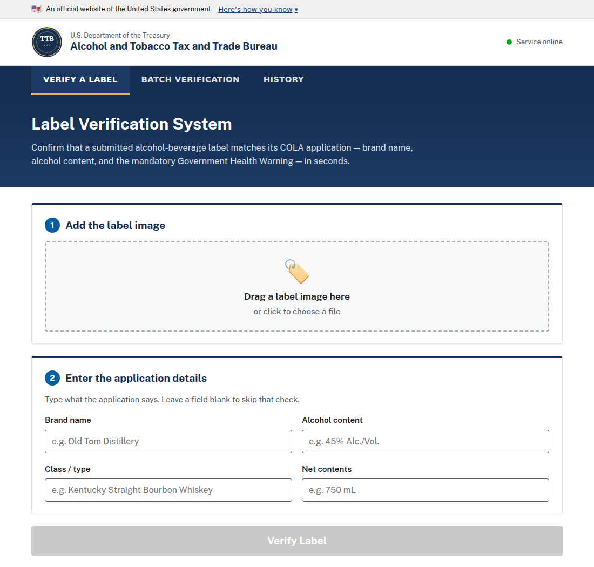

# TTB Alcohol Label Verification — Prototype

AI-assisted verification that an alcohol-beverage **label image** matches the data in its
**COLA application**, for the Alcohol and Tobacco Tax and Trade Bureau (TTB).

**🌐 Live demo:** https://51-81-34-160.nip.io
*(Prototype only. Not connected to COLA. Nothing you upload is stored.)*

---

## What it does

An agent uploads a label image (or a batch of them) plus the expected application fields, and
within a few seconds the app reports — per field — whether the label matches:

- **Brand name** — case/punctuation-tolerant per agent judgment (`STONE'S THROW` == `Stone's Throw`)
- **Alcohol content (ABV)** — numeric match, tolerant of formatting (`45`, `45%`, `45% Alc./Vol.`)
- **Government Health Warning** — present **and exact**: `GOVERNMENT WARNING:` in all-caps,
  word-for-word per 27 CFR 16.21 (catches paraphrases, title-case headers, omissions)
- Plus **class/type** and **net contents** when supplied in the application

It also supports **batch** uploads (hundreds of labels) with a pass/fail summary, and a
**History** tab where any single or batch check can be saved with a custom name and timestamp.

The interface is built to the **U.S. Web Design System (USWDS)** — the official standard for
federal websites — so it reads as a genuine TTB/Treasury system: the official-government banner,
the agency seal header, navy primary navigation, and USWDS alert/button components.

- **History** — click *"Save to history as…"* (or *"Save batch to history as…"*) on any result,
  name it, and it appears in the History tab with a timestamp. Stored **locally in the browser
  only** (localStorage) — nothing is persisted server-side, in keeping with the no-PII guidance.

## Screenshot

The single-label screen, in the federal design system — official banner, agency seal, navy nav:



## How it works

```
Browser (static HTML/CSS/JS)
        │  multipart upload (image + expected fields)
        ▼
FastAPI  ──►  OpenRouter (vision model)  ──►  strict-JSON label fields
        │                                          │
        └──────────►  deterministic matching  ◄────┘
                      (brand judgment · ABV · EXACT warning)
        ▼
  PASS / FAIL + per-field results  (≈4–5s)
```

- One vision call per label extracts the printed fields as JSON; matching is **deterministic
  Python** (no second LLM call) so results are fast, auditable, and consistent.
- The government-warning check is the strict one: it enforces the all-caps header and compares
  the body to the statutory text word-for-word.

See [`docs/SPEC.md`](docs/SPEC.md) for the full contract and [`docs/APPROACH.md`](docs/APPROACH.md)
for approach, tools, assumptions, and trade-offs.

## Project layout

```
backend/
  app/
    config.py        # .env-backed settings
    openrouter.py    # async OpenRouter (OpenAI-compatible) client
    extraction.py    # image -> structured label fields (strict JSON)
    verification.py  # deterministic matching rules (pure functions)
    main.py          # FastAPI: /health, /verify, /verify/batch, serves frontend
  tests/             # 24 unit tests (matching logic + mocked client + extraction)
frontend/            # single-page UI (index.html, style.css, app.js) — no build step
samples/             # generator + 5 synthetic test labels + applications.json
docs/                # SPEC.md, APPROACH.md
```

## Run it locally

Requires Python 3.12 (3.11–3.13 fine; 3.14 lacks some wheels). [`uv`](https://docs.astral.sh/uv/)
recommended but plain `venv` works.

```bash
git clone https://github.com/Julian-Stancioff/ttb-label-verification.git
cd ttb-label-verification

# 1. Configure your OpenRouter key
cp .env.example .env        # then edit .env and set OPENROUTER_API_KEY

# 2. Install + run
cd backend
uv venv --python 3.12 .venv && source .venv/bin/activate
uv pip install -r requirements.txt          # or: pip install -r requirements.txt
uvicorn app.main:app --host 0.0.0.0 --port 8000

# 3. Open http://localhost:8000
```

### Tests

```bash
cd backend && source .venv/bin/activate
python -m pytest -q          # 24 passing
```

### Generate sample labels

```bash
cd backend && source .venv/bin/activate && pip install pillow
python ../samples/generate_samples.py       # writes samples/images/*.png + applications.json
```

## Configuration (`.env`)

| Key | Default | Notes |
| --- | --- | --- |
| `OPENROUTER_API_KEY` | — | **required** |
| `OPENROUTER_BASE_URL` | `https://openrouter.ai/api/v1` | OpenAI-compatible endpoint |
| `LLM_MODEL` | `anthropic/claude-sonnet-4.5` | any OpenRouter vision model |
| `HOST` / `PORT` | `0.0.0.0` / `8000` | server bind |
| `BATCH_CONCURRENCY` | `8` | parallel labels per batch request |
| `REQUEST_TIMEOUT` | `20` | per-label model timeout (s) |

## API

| Method | Path | Body | Returns |
| --- | --- | --- | --- |
| `GET` | `/health` | — | `{status, model, configured}` |
| `POST` | `/verify` | `image` (file) + `application` (JSON string) | `{overall, fields[], extracted, elapsed_ms, warning_detail}` |
| `POST` | `/verify/batch` | `images[]` + `applications` (JSON array) | `{results[], summary{pass,fail,error,total}}` |

```bash
curl -s -X POST https://51-81-34-160.nip.io/verify \
  -F "image=@samples/images/01_pass_old_tom.png" \
  -F 'application={"brand_name":"Old Tom Distillery","alcohol_content":"45% Alc./Vol."}'
```

## Deployment

The live demo runs on a Linux VPS: a `systemd` unit runs `uvicorn` on `127.0.0.1:8000`, and
**Caddy** terminates HTTPS (automatic Let's Encrypt cert) at `51-81-34-160.nip.io`, reverse-proxying
to the app. No database; uploads are processed in memory and discarded.

## Note on how this was built

This prototype was developed using [**Gas Town**](https://github.com/gastownhall/gastown), a
multi-agent orchestration system, as the workflow harness — the work was tracked as **beads**
(issues) in a Gas Town *rig*, and an autonomous *polecat* agent produced the initial backend-core
commit. See [`docs/APPROACH.md`](docs/APPROACH.md) for details.

## License

MIT — see [LICENSE](LICENSE).
